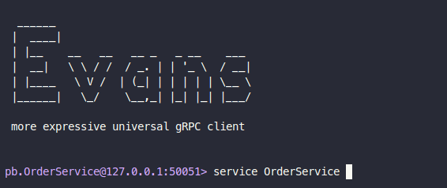
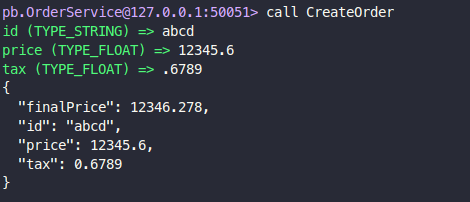

# clean-architecture
Esta listagem precisa ser feita com:

- Endpoint REST (GET /order)

- Service ListOrders com GRPC

- Query ListOrders GraphQL

## Instalação
### Clone o repositorio
```bash
git clone https://github.com/GiovaniGitHub/clean-architecture.git 
```
### Instalar o go mod
```bash
cd clean-architecture && go mod tidy
```

### Up os containers
```bash
docker-compose up -d
```
### Executar o comando
```bash
cd cmd/ordersystem && go run main.go wire_gen.go
```

## Testes
### REST API
- Para o teste podera utilizar o arquivo `./api/create_order.http` utilizando o plugin Rest Client (https://marketplace.visualstudio.com/items?itemName=humao.rest-client)
- Caso queira usar o CURL pode fazer os mesmo testes usando os comandos abaixo:
```bash
curl -X POST http://localhost:8000/order \
-H "Host: localhost:8000" \
-H "Content-Type: application/json" \
-d '{
    "id":"a",
    "price": 300.5,
    "tax": 0.5
}'
```
```bash
curl -X GET http://localhost:8000/order \
-H "Host: localhost:8000" \
-H "Content-Type: application/json"
```

OBS: O campo `id` é chave primária no banco por isso uma vez inserido e caso queira inserir um novo deverá ser gerado um novo `id`.

### GraphQL
- Para o teste usando graphql é necessário acessar o endpoint `http://localhost:8080` e utilizar o template:
```graphql
mutation createOrder {
    createOrder(input: {
        id: "aa",
        Price: 1300.5,
        Tax: 0.8
    }) {
        id Price Tax FinalPrice
    }
}

query orders {
    listOrders {
        id Price Tax FinalPrice
    }
}
```
### gRPC
- Para testar usando gRPC é necessario o uso do evans (https://github.com/ktr0731/evans)

- Execute o evans apontando para o `internal/infra/grpc/protofiles/order.proto`
- No prompt do evans deve executar o comando `service OrderRequest`


- Para criar uma nova ordem execute o comando `call CreateOrder`


- Para listar os pedidos execute o comando `call ListOrders`

